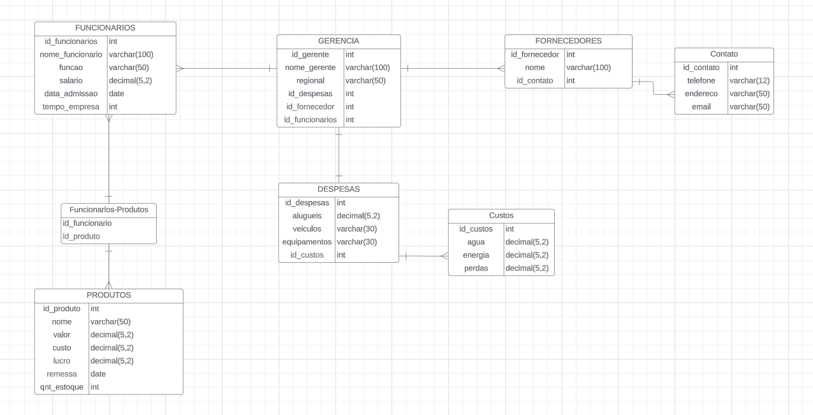

# MDB_Mercado

**Cenário e Modelagem de Banco de Dados para o Mercado "Joca"**

 

**Cenário:**

Este documento detalha a necessidade e a modelagem do banco de dados para o complexo fictício de mercado chamado "Joca". O sistema foi concebido para atender às demandas específicas de um ambiente de varejo, garantindo uma gestão eficiente de produtos, funcionários, fornecedores, gerência, ativos e despesas.

**Entidades, Atributos e Relacionamentos:**

- Produtos:

    Atributos:
    - id_produto (Chave Primária)
    - nome (Atributo Simples)
    - valor (Atributo Simples)
    - custo (Atributo Simples)
    - lucro (Atributo Derivado)
    - remessa (Atributo Simples)
    - qnt_estoque (Atributo Simples)
    Relacionamentos:
    Um produto pode estar relacionado a muitas entradas na tabela funcionarios_produtos (Muitos para Muitos).

- Funcionários:

    Atributos:
    - id_funcionarios (Chave Primária)
    - nome_funcionario (Atributo Simples)
    - funcao (Atributo Simples)
    - salario (Atributo Simples)
    - data_admissao (Atributo Simples)
    Relacionamentos:
    Um funcionário pode ser responsável por muitos produtos (Um para Muitos).
    Um funcionário pode estar associado a muitas entradas na tabela gerencia (Muitos para Muitos).

- Fornecedores:

    Atributos:
    - id_fornecedor (Chave Primária)
    - nome (Atributo Simples)
    Relacionamentos:
    Um fornecedor pode fornecer muitos produtos (Um para Muitos).
    Um fornecedor pode ter muitos contatos na tabela contato (Um para Muitos).

- Gerência:

    Atributos:
    - id_gerente (Chave Primária)
    - nome_gerente (Atributo Simples)
    - regional (Atributo Simples)
    Relacionamentos:
    Um gerente está associado a muitos funcionários (Um para Muitos).
    Um gerente pode estar associado a muitos ativos (Um para Muitos).

- Despesas:

    Atributos:
    - id_despesas (Chave Primária)
    - alugueis (Atributo Simples)
    - veiculos (Atributo Simples)
    - equipamentos (Atributo Simples)
    Relacionamentos:
    Muitos produtos podem estar relacionados a muitos ativos na tabela gerencia (Muitos para Muitos).

- Custos:

    Atributos:
    - agua (Atributo Simples)
    - energia (Atributo Simples)
    - perdas (Atributo Simples)
    Relacionamentos:
    Muitos ativos podem estar associados a muitas despesas na tabela gerencia (Muitos para Muitos).

---
 

**Modelagem conceitual - DER**

---
 

**Modelagem Lógica:**

---
 

**Modelagem Física (Criação das tabelas e Inserção de Dados):**

Estão na pasta SCRIPT

---
 

**CRUD:**

Estão na pasta CRUD

---
 

**Relatórios:**

Prints das consultas na pasta "Relatórios"

1. **Listar todos os produtos com seus preços**

2. **Encontrar funcionários e suas funções**

3. **Visualizar os fornecedores e seus contatos**

4. **Identificar os produtos com estoque baixo**

5. **Listar todos os gerentes e suas regiões**

6. **Mostrar os despesas e os custos associados**

7. **Exibir funcionários e a data de admissão**

8. **Ordenar produtos por nome de forma ascendente**

9. **Encontrar fornecedores com nome e ID de contato**

10. **Identificar os produtos com maior lucro**
